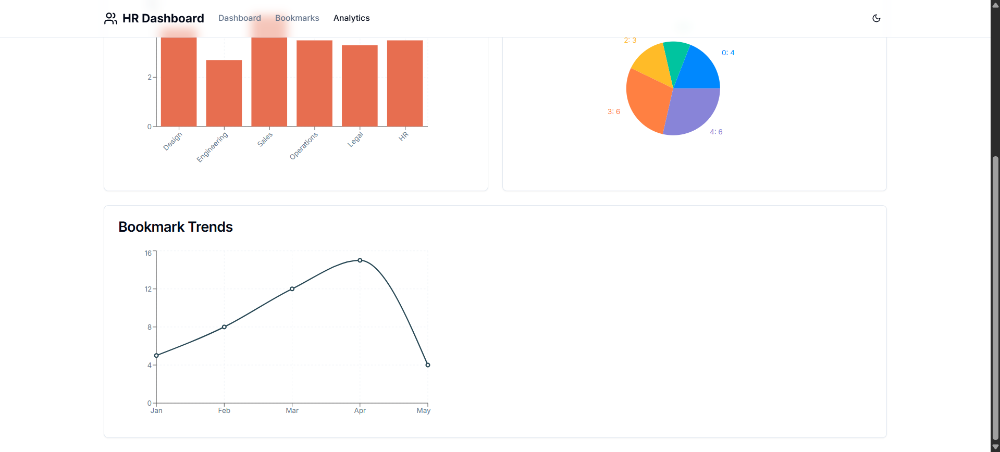

# 🏢 HR Performance Dashboard

A modern, comprehensive HR Dashboard built with Next.js, TypeScript, and Tailwind CSS for managing employee performance, bookmarks, and analytics.

## 🚀 Features

### ✅ Core Features Implemented

#### 🏠 **Dashboard Homepage**
- **Employee Cards**: Display all employees with profile pictures, ratings, and department badges
- **Performance Ratings**: Visual 5-star rating system with color-coded indicators
- **Quick Actions**: View, Bookmark, and Promote buttons for each employee
- **Real-time Data**: Fetches from dummyjson.com API with enhanced mock data

#### 🔍 **Advanced Search & Filtering**
- **Smart Search**: Filter by name, email, or department (case-insensitive)
- **Multi-select Filters**: Department and rating-based filtering
- **Visual Filter Tags**: Clear active filters with removable badges
- **Real-time Results**: Instant filtering without page refresh

#### 👤 **Employee Detail Pages**
- **Comprehensive Profiles**: Full contact information and bio
- **Tabbed Interface**: Overview, Projects, and Feedback sections
- **Performance History**: Track ratings and achievements over time
- **Project Management**: View current projects with progress tracking

#### 📌 **Bookmark Management**
- **Persistent Bookmarks**: Save important employees across sessions
- **Dedicated Page**: Manage all bookmarked employees in one place
- **Quick Actions**: Remove bookmarks and perform bulk operations

#### 📊 **Analytics Dashboard**
- **Department Performance**: Bar charts showing average ratings by department
- **Rating Distribution**: Pie chart visualization of performance spread
- **Bookmark Trends**: Line chart tracking bookmark activity over time
- **Key Metrics**: Summary cards with total employees, average ratings, and top performers

### 🎯 **Advanced Features**

#### ➕ **Employee Creation**
- **Modal Form**: Add new employees with validation
- **Form Validation**: Real-time validation for all required fields
- **Department Selection**: Dropdown with predefined departments
- **Auto-generation**: Automatic rating and bio generation

#### 🎨 **UI/UX Enhancements**
- **Dark/Light Mode**: Toggle between themes with smooth transitions
- **Responsive Design**: Optimized for mobile, tablet, and desktop
- **Loading States**: Skeleton loaders and loading indicators
- **Hover Effects**: Interactive cards with smooth animations
- **Modern Icons**: Lucide React icons throughout

#### 📱 **Responsive Design**
- **Mobile-First**: Optimized for all screen sizes
- **Adaptive Layout**: Grid layouts that adjust to screen width
- **Touch-Friendly**: Large touch targets for mobile devices
- **Accessible**: ARIA labels and keyboard navigation support

## 🛠 Tech Stack

- **Framework**: Next.js 14 (App Router)
- **Language**: TypeScript
- **Styling**: Tailwind CSS
- **State Management**: Zustand with persistence
- **UI Components**: shadcn/ui
- **Charts**: Recharts
- **Icons**: Lucide React
- **Data Source**: DummyJSON API

## 📦 Installation & Setup

### Prerequisites
- Node.js 18+ 
- npm or yarn package manager

### 1. Clone the Repository
\`\`\`bash
git clone <repository-url>
cd hr-dashboard
\`\`\`

### 2. Install Dependencies
\`\`\`bash
npm install
# or
yarn install
\`\`\`

### 3. Run Development Server
\`\`\`bash
npm run dev
# or
yarn dev
\`\`\`

### 4. Open in Browser
Navigate to [http://localhost:3000](http://localhost:3000)

### 5. Build for Production
\`\`\`bash
npm run build
npm start
# or
yarn build
yarn start
\`\`\`

## 📁 Project Structure

\`\`\`
hr-dashboard/
├── app/                    # Next.js App Router
│   ├── analytics/         # Analytics page
│   ├── bookmarks/         # Bookmarks page
│   ├── employee/[id]/     # Dynamic employee detail pages
│   ├── globals.css        # Global styles
│   ├── layout.tsx         # Root layout
│   ├── loading.tsx        # Loading component
│   └── page.tsx          # Homepage
├── components/            # Reusable UI components
│   ├── layout/           # Layout components
│   │   └── header.tsx    # Navigation header
│   ├── theme-provider.tsx # Theme context provider
│   └── ui/               # UI components
│       ├── create-user-modal.tsx
│       ├── pagination.tsx
│       ├── rating.tsx
│       ├── search-filters.tsx
│       └── user-card.tsx
├── hooks/                # Custom React hooks
│   ├── useBookmarks.ts   # Bookmark management
│   └── useUsers.ts       # User data management
├── lib/                  # Utilities and configuration
│   ├── store.ts          # Zustand store
│   └── utils.ts          # Helper functions
├── types/                # TypeScript definitions
│   └── index.ts          # Type definitions
├── package.json          # Dependencies
├── tailwind.config.js    # Tailwind configuration
└── tsconfig.json         # TypeScript configuration
\`\`\`

## 📸 Screenshots

### 🏠 Dashboard Homepage

*Main dashboard with employee cards, search, and filtering capabilities*

### 📌 Bookmarks Page

*Dedicated page for managing bookmarked employees*

### 📊 Analytics Dashboard

*Data visualization with charts and key metrics*

### 🌙 Dark Mode

*Beautiful dark theme with smooth transitions*

## 🎯 Key Features Breakdown

### State Management
- **Zustand Store**: Centralized state management with persistence
- **Custom Hooks**: Reusable logic for users and bookmarks
- **Local Storage**: Persistent bookmarks and theme preferences

### Data Management
- **API Integration**: Fetches real user data from DummyJSON
- **Data Enhancement**: Adds departments, ratings, and additional fields
- **Real-time Filtering**: Efficient client-side filtering and search
- **Pagination**: Performance-optimized pagination system

### User Experience
- **Instant Feedback**: Loading states and smooth transitions
- **Keyboard Navigation**: Full keyboard accessibility
- **Error Handling**: Graceful error states and fallbacks
- **Performance**: Optimized rendering and state updates

## 🚀 Performance Optimizations

- **Code Splitting**: Automatic code splitting with Next.js
- **Image Optimization**: Next.js Image component with lazy loading
- **State Optimization**: Efficient re-renders with proper state management
- **Bundle Size**: Tree-shaking and optimized imports
- **Caching**: Browser caching for static assets

## 🔧 Configuration

### Environment Variables
Create a `.env.local` file for any environment-specific configurations:

\`\`\`env
# Add any API keys or configuration here
NEXT_PUBLIC_API_URL=https://dummyjson.com
\`\`\`

### Customization
- **Themes**: Modify `globals.css` for custom color schemes
- **Components**: Extend or modify components in `/components/ui/`
- **Data**: Update mock data generation in `/lib/utils.ts`
- **Styling**: Customize Tailwind config in `tailwind.config.js`

## 🤝 Contributing

1. Fork the repository
2. Create a feature branch (`git checkout -b feature/amazing-feature`)
3. Commit your changes (`git commit -m 'Add amazing feature'`)
4. Push to the branch (`git push origin feature/amazing-feature`)
5. Open a Pull Request

## Acknowledgments

- **shadcn/ui** for the beautiful component library
- **DummyJSON** for providing test data
- **Lucide** for the comprehensive icon set
- **Recharts** for the charting capabilities
- **Zustand** for simple state management

## Support

email kishansah7086@gmail.com or create an issue in the repository.

---

**Built with ❤️ using Next.js, TypeScript, and Tailwind CSS**
